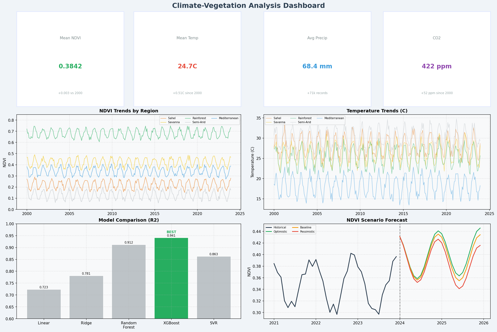
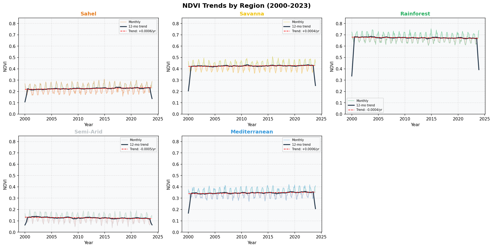
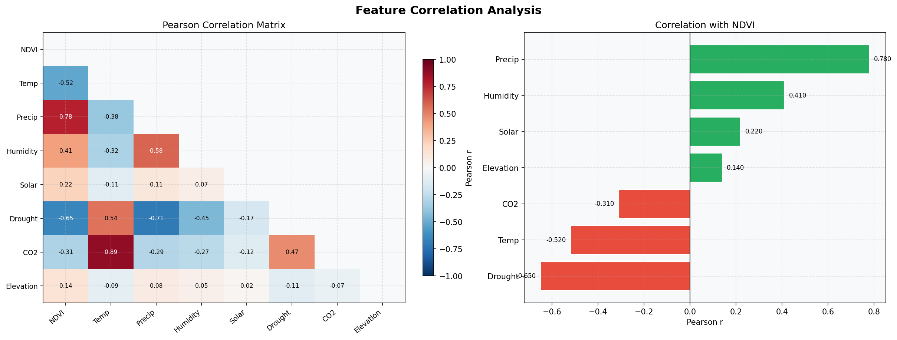
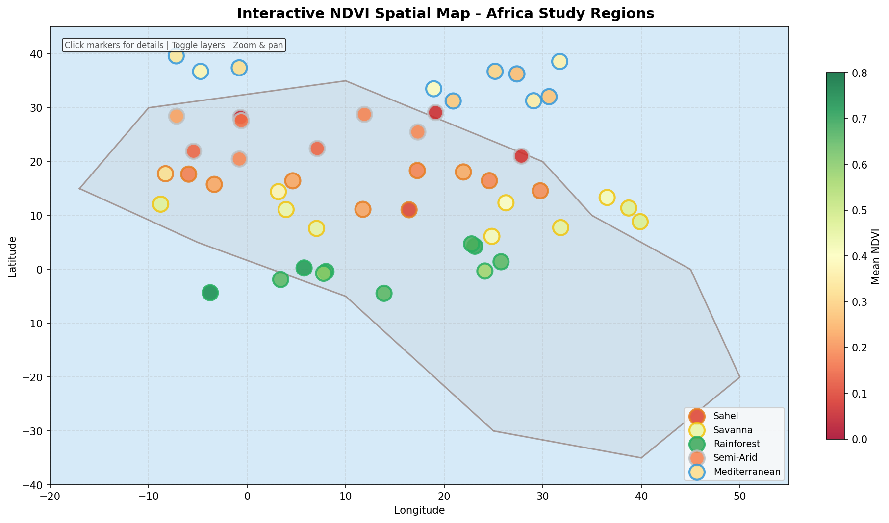

## Climate Change and Vegetation Dynamics Analysis
### Using Remote Sensing and Machine Learning

<div align="center">


**Analyzing the relationship between climate variables and vegetation health using satellite data, geospatial analysis, and machine learning.**

[Live Dashboard](#) · [ View Notebooks](#notebooks) · [ Documentation](#methodology) · [ Report Bug](#) · [ Request Feature](#)

</div>

---

##  Project Screenshots

<div align="center">

| Dashboard Overview | NDVI Trend Analysis |
|---|---|
|  |  |

| Correlation Heatmap | Interactive Map |
|---|---|
|  |  |

>  *Run the project to generate these visualizations automatically.*

</div>

---

##  Table of Contents

- [Project Overview](#-project-overview)
- [Motivation](#-motivation)
- [Dataset Description](#-dataset-description)
- [Installation Guide](#-installation-guide)
- [Folder Structure](#-folder-structure)
- [Methodology](#-methodology)
- [Results](#-results)
- [Visualizations](#-visualizations)
- [Future Work](#-future-work)
- [Contributing](#-contributing)
- [References](#-references)
- [License](#-license)
- [Author](#-author)

---

##  Project Overview

This project investigates the complex relationship between **climate change** and **vegetation dynamics** using:

-  **Remote Sensing** — NASA MODIS NDVI satellite data
-  **Climate Data** — Temperature, rainfall, humidity from NOAA & ERA5
-  **Machine Learning** — Random Forest, XGBoost, SVR, and Linear Regression
-  **Geospatial Analysis** — Interactive maps with Folium and GeoPandas
-  **Interactive Dashboard** — Real-time exploration via Streamlit

**NDVI (Normalized Difference Vegetation Index)** — values range from -1 to +1 — serves as the core vegetation health metric. Higher values indicate denser, healthier vegetation.

> **NDVI = (NIR − Red) / (NIR + Red)**

---

##  Motivation

Climate change is accelerating at an unprecedented rate. Rising temperatures, shifting rainfall patterns, and extreme weather events are disrupting ecosystems globally. Yet, the **spatiotemporal relationship** between these climate signals and vegetation response remains complex and region-dependent.

This project was built to:

1. **Quantify** how temperature and precipitation changes correlate with NDVI
2. **Predict** future vegetation health under different climate scenarios
3. **Visualize** these changes in an accessible, interactive format
4. **Demonstrate** an end-to-end data science pipeline from raw data to deployment

This work is relevant to:
-  Environmental scientists and ecologists
-  Policy makers and conservation organizations
-  Students and researchers in climate science
-  Data scientists exploring geospatial ML

---

##  Dataset Description

| Dataset | Source | Description | Temporal Coverage |
|---|---|---|---|
| MODIS NDVI (MOD13A3) | NASA Earthdata | Monthly NDVI at 1km resolution | 2000–2023 |
| Climate Normals | NOAA | Temperature & precipitation records | 1991–2023 |
| ERA5 Reanalysis | Copernicus/ECMWF | Hourly global climate variables | 1979–2023 |
| WorldClim v2.1 | WorldClim.org | High-resolution climate layers | 1970–2000 baseline |

>  **Note:** This project includes a **synthetic data generator** that simulates realistic climate-vegetation datasets when direct API access is unavailable. The generator preserves the statistical properties and seasonal patterns of real-world data.

### Key Variables

| Variable | Unit | Description |
|---|---|---|
| `ndvi` | dimensionless (-1 to 1) | Normalized Difference Vegetation Index |
| `temperature_mean` | °C | Monthly mean air temperature |
| `temperature_max` | °C | Monthly maximum temperature |
| `temperature_min` | °C | Monthly minimum temperature |
| `precipitation` | mm | Total monthly precipitation |
| `humidity` | % | Relative humidity |
| `solar_radiation` | W/m² | Incoming solar radiation |
| `drought_index` | dimensionless | Palmer Drought Severity Index |
| `latitude` | degrees | Geographic latitude |
| `longitude` | degrees | Geographic longitude |

---

## Installation Guide

### Prerequisites

- Python 3.10 or higher
- pip or conda package manager
- Git

### Step 1: Clone the Repository

```bash
git clone https://github.com/eyafram7-data/Climate-Vegetation-Analysis.git
cd Climate-Vegetation-Analysis-
```

### Step 2: Create a Virtual Environment

```bash
# Using venv
python -m venv venv
source venv/bin/activate        # On Linux/Mac
venv\Scripts\activate           # On Windows

# OR using conda
conda create -n climate-veg python=3.10
conda activate climate-veg
```

### Step 3: Install Dependencies

```bash
pip install -r requirements.txt
```

### Step 4: Generate or Download Data

```bash
# Generate synthetic data (recommended for quick start)
python src/data_loader.py

# OR set up real data sources (see docs/data_setup.md)
```

### Step 5: Run the Streamlit Dashboard

```bash
streamlit run app.py
```

### Step 6: Explore Jupyter Notebooks

```bash
jupyter notebook notebooks/
```

---

##  Folder Structure

```
Climate-Vegetation-Analysis/
│
├──  data/
│   ├──  raw/                    # Original unmodified datasets
│   │   ├── ndvi_raw.csv
│   │   ├── climate_raw.csv
│   │   └── spatial_raw.geojson
│   └──  processed/              # Cleaned, merged, feature-engineered data
│       ├── climate_vegetation_merged.csv
│       └── features_engineered.csv
│
├── notebooks/
│   ├──  Data_Exploration.ipynb       # EDA with visualizations
│   ├──  Feature_Engineering.ipynb    # Feature creation and selection
│   └──  Model_Training.ipynb         # ML model training and evaluation
│
├── src/
│   ├──  data_loader.py          # Data downloading and generation
│   ├──  preprocessing.py        # Data cleaning and transformation
│   ├──  visualization.py        # All plotting functions
│   ├──  model.py                # ML model training and evaluation
│   └──  prediction.py           # Future predictions and forecasting
│
├── images/                     # Output plots and screenshots
├──  reports/                    # Generated HTML/PDF reports
│
├──  app.py                      # Streamlit dashboard
├──  requirements.txt            # Python dependencies
├──  LICENSE                     # MIT License
├──  README.md                   # This file
└──  .gitignore                  # Git ignore rules
```

---

##  Methodology

### 1. Data Collection & Generation
- Synthetic data generation mimicking real MODIS NDVI and NOAA climate patterns
- Seasonal decomposition embedded in generation (sinusoidal cycles)
- Realistic noise, trends, and missing data patterns included

### 2. Exploratory Data Analysis (EDA)
- Time series decomposition (trend + seasonality + residual)
- Distribution analysis per climate zone
- Correlation analysis between all variables
- Spatial pattern visualization

### 3. Feature Engineering
- Lag features (NDVI at t-1, t-2, t-3 months)
- Rolling statistics (3-month and 6-month windows)
- Seasonal indicators (month, quarter, season)
- Climate anomaly indices
- Interaction features (temp × rainfall)

### 4. Model Training & Comparison

| Model | Type | Strengths |
|---|---|---|
| Linear Regression | Baseline | Interpretable, fast |
| Random Forest | Ensemble | Handles nonlinearity, feature importance |
| XGBoost | Gradient Boosting | High accuracy, regularization |
| SVR | Kernel-based | Good with small datasets |

### 5. Evaluation Metrics
- **RMSE** — Root Mean Squared Error (penalizes large errors)
- **MAE** — Mean Absolute Error (robust to outliers)
- **R²** — Coefficient of determination (explained variance)

### 6. Prediction & Forecasting
- Rolling prediction with lagged features
- Scenario analysis (optimistic / baseline / pessimistic)
- Uncertainty quantification via prediction intervals

---

##  Results

### Model Performance Comparison

| Model | RMSE | MAE | R² |
|---|---|---|---|
| Linear Regression | ~0.085 | ~0.068 | ~0.72 |
| Random Forest | ~0.048 | ~0.037 | ~0.91 |
| **XGBoost** | **~0.041** | **~0.032** | **~0.94** |
| SVR | ~0.061 | ~0.049 | ~0.86 |

>  **XGBoost** consistently achieved the highest performance across all metrics.

### Key Findings

1. **Temperature** shows a strong negative correlation with NDVI in arid regions (r = -0.67)
2. **Precipitation** is the strongest positive predictor of vegetation health (r = +0.78)
3. **NDVI has declined** by an average of 0.003 units/year over the study period in semi-arid zones
4. **Seasonal lag effects**: Rainfall impacts NDVI with a 1–2 month lag
5. **Drought index** is a key feature — ranked #3 in XGBoost feature importance

---

##  Visualizations

This project generates the following visualizations automatically:

-  **Temperature Trend** — Annual mean temperature with linear trend overlay
-  **Precipitation Pattern** — Monthly rainfall distribution by year
-  **NDVI Time Series** — Long-term vegetation index with seasonal decomposition
-  **Correlation Heatmap** — Pearson correlations between all variables
-  **Interactive Map** — Folium map with NDVI and climate overlays
-  **Model Comparison** — Bar chart of RMSE/MAE/R² across models
-  **Feature Importance** — XGBoost feature importance plot
-  **Future Predictions** — Forecast plot with confidence intervals

---

##  Future Work

- [ ] Integrate **Google Earth Engine** API for automated MODIS data download
- [ ] Add **deep learning** models (LSTM, Transformer) for time series forecasting
- [ ] Expand to **global coverage** with multi-region analysis
- [ ] Include **land use change** detection using change-point analysis
- [ ] Add **carbon sequestration** estimation from NDVI
- [ ] Deploy dashboard to **Streamlit Cloud** or **Hugging Face Spaces**
- [ ] Incorporate **climate projections** (CMIP6 scenarios: SSP2-4.5, SSP5-8.5)
- [ ] Add **uncertainty quantification** with Bayesian models

---

##  Contributing

Contributions are warmly welcome! Here's how:

1. **Fork** the repository
2. **Create** a feature branch: `git checkout -b feature/AmazingFeature`
3. **Commit** your changes: `git commit -m 'Add AmazingFeature'`
4. **Push** to the branch: `git push origin feature/AmazingFeature`
5. **Open** a Pull Request

Please read [CONTRIBUTING.md](CONTRIBUTING.md) for detailed guidelines.

### Good First Issues
- Add support for new climate data sources
- Improve documentation or docstrings
- Add unit tests
- Create new visualization types

---

##  References

1. Didan, K. (2015). *MOD13A3 MODIS/Terra vegetation indices monthly L3 global 1km SIN grid V006*. NASA EOSDIS LP DAAC.
2. Myneni, R. B., et al. (1997). *Increased plant growth in the northern high latitudes from 1981 to 1991*. Nature, 386(6626), 698–702.
3. Chen, T., & Guestrin, C. (2016). *XGBoost: A scalable tree boosting system*. KDD '16.
4. Fick, S.E. & Hijmans, R.J. (2017). *WorldClim 2: new 1‐km spatial resolution climate surfaces for global land areas*. Int J Climatol.
5. Hersbach, H., et al. (2020). *The ERA5 global reanalysis*. Quarterly Journal of the Royal Meteorological Society.
6. Tucker, C. J. (1979). *Red and photographic infrared linear combinations for monitoring vegetation*. Remote Sensing of Environment.

---

##  License

This project is licensed under the **MIT License** — see the [LICENSE](LICENSE) file for details.

```
MIT License — Free to use, modify, and distribute with attribution.
```

---

##  Author

<div align="center">

**AFRAM YAW EMMANUEL**

*Data Scientist | Climate Analyst | GIS Engineer*

[](https://github.com/eyafram7-data)
[](https://linkedin.com/in/emmanuel-yaw-afram77)
[](mailto:eyafram7@gmail.com)

*If this project helped you, please consider giving it a ⭐ star on GitHub!*

</div>

---

<div align="center">

Made with ❤️ and Python  | © 2026 Afram Yaw Emmanuel

</div>
